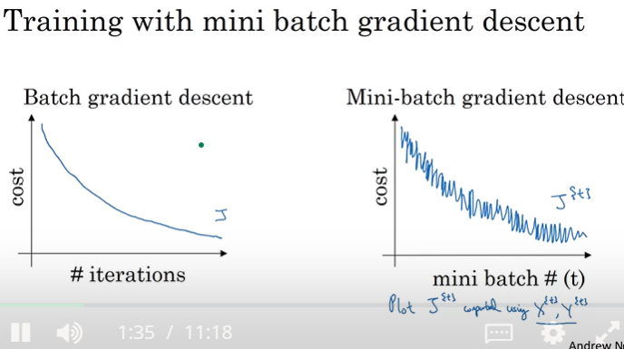

## Batch vs Mini-batch gradient descent

Vectorization allows us to efficiently compute on *m* examples

1. Mini batches
   - m = 5,000,000
   - mini batches of t = 1,000 each with m1 - mt (this is an example)
   - 

## Adam Optimization Algorithm

The Adam optimization algorithm is an extension to stochastic gradient descent that has recently seen broader adoption for deep learning applications in computer vision and natural language processing.

Attractive benefits of using Adam on non-convex optimization problems, as follows:
   - Straightforward to implement.
   - Computationally efficient.
   - Little memory requirements.
   - Invariant to diagonal rescale of the gradients.
   - Well suited for problems that are large in terms of data and/or parameters.
   - Appropriate for non-stationary objectives.
   - Appropriate for problems with very noisy/or sparse gradients.
   - Hyper-parameters have intuitive interpretation and typically require little tuning.

In practice Adam is currently recommended as the default algorithm to use, and often works slightly better than RMSProp. However, it is often also worth trying SGD+Nesterov Momentum as an alternative.

### Adam Configuration Parameters
1. alpha. Also referred to as the learning rate or step size. The proportion that weights are updated (e.g. 0.001). Larger values (e.g. 0.3) results in faster initial learning before the rate is updated. Smaller values (e.g. 1.0E-5) slow learning right down during training
2. beta1. The exponential decay rate for the first moment estimates (e.g. 0.9).
3. beta2. The exponential decay rate for the second-moment estimates (e.g. 0.999). This value should be set close to 1.0 on problems with a sparse gradient (e.g. NLP and computer vision problems).
4. epsilon. Is a very small number to prevent any division by zero in the implementation (e.g. 10E-8).

Good default settings for the tested machine learning problems are alpha=0.001, beta1=0.9, beta2=0.999 and epsilon=10−8

We can see that the popular deep learning libraries generally use the default parameters recommended by the paper.

1. TensorFlow: learning_rate=0.001, beta1=0.9, beta2=0.999, epsilon=1e-08.
2. Keras: lr=0.001, beta_1=0.9, beta_2=0.999, epsilon=1e-08, decay=0.0.
3. Blocks: learning_rate=0.002, beta1=0.9, beta2=0.999, epsilon=1e-08, decay_factor=1.
4. Lasagne: learning_rate=0.001, beta1=0.9, beta2=0.999, epsilon=1e-08
5. Caffe: learning_rate=0.001, beta1=0.9, beta2=0.999, epsilon=1e-08
6. MxNet: learning_rate=0.001, beta1=0.9, beta2=0.999, epsilon=1e-8
7. Torch: learning_rate=0.001, beta1=0.9, beta2=0.999, epsilon=1e-8